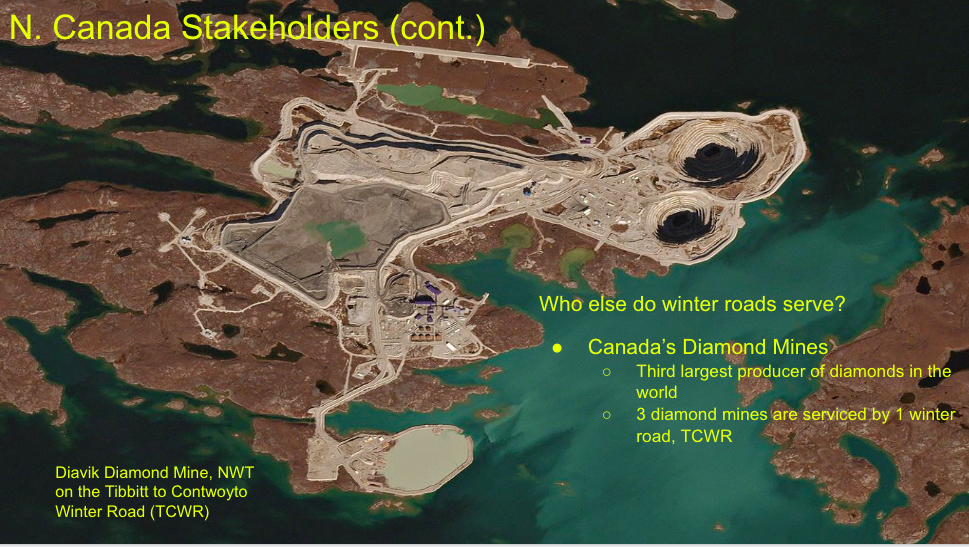
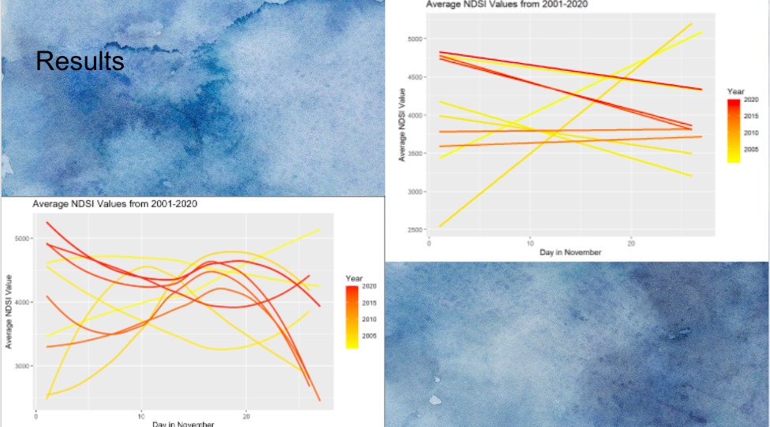
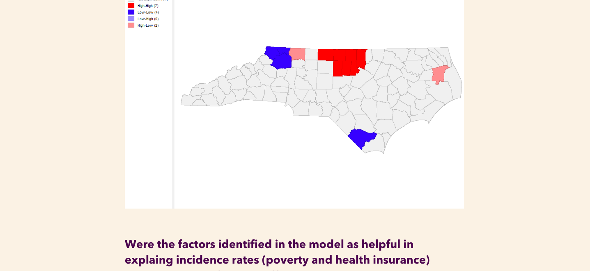
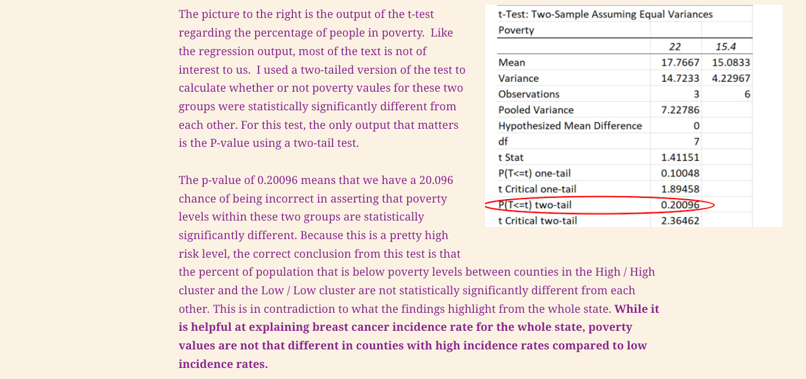
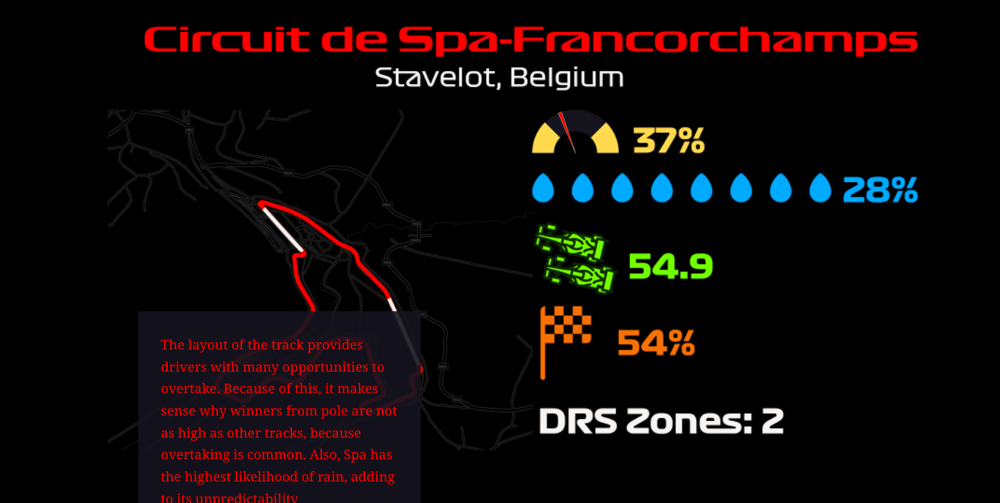
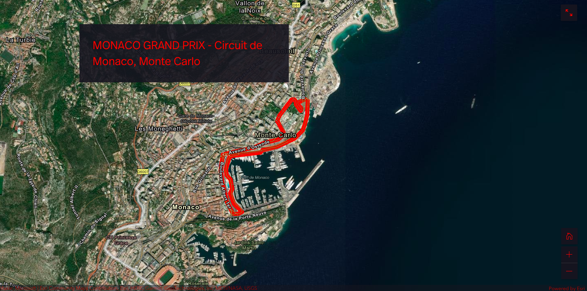
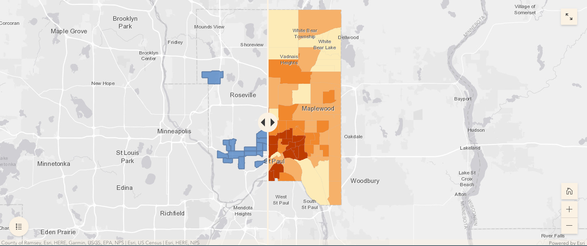
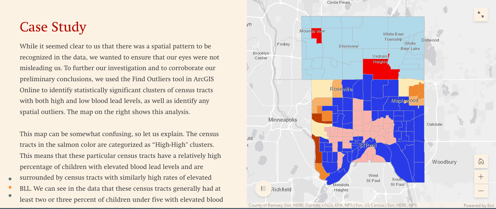

```{r setup, include=FALSE}
knitr::opts_chunk$set(echo = FALSE)

```


### About 

My name is Quinn Frankovsky and I am a recent graduate from Macalester College. I received my bachelors in Geography and Data Science. I was born in Boulder, CO and played soccer on the Macalester Men's Soccer Varisty team. I was a teacher assistant for several classes in the Geography Department at Mac, and I will be working as a Geospatial Intern for Traveler's Insurance in the Summer of 2022. I appreicate the breadth of analysis that GIS and other geospatial softwares provide.  

\
\
\
\
\


## Projects


### Assessing the Impacts of Climate Chagne to the Winter Road Industry in N. Canada
The aim of this project was to use remote sensing techniques to understand the ways in which climate change impacted and continues to impact the winter road, or ice road, season in Northern Canada. I used NDSI (Normalized Snow Difference Index) values from the MODIS Terra Satellite to compute average NDSI values for a 20 year period. Fluctuations in snow and ice accumulation greatly impact those who use the winter road to survive. 






Link to presentation - https://docs.google.com/presentation/d/16jRGB5Iq8qtXOX-KDUjvivXLyYOakvFJxqC4rCx3QHc/edit?usp=sharing


\
\


### Identifying and Assessing Socioeconomic and Demographic Variables to Explain Patterns of Breast Cancer Incidence Rate in North Carolina 
For this project, I studied the relationship between breast cancer incidence, as my outcome variable, and poverty, race, vehicle availability, and health insurance coverage, which were my predicting variables. I estimated the spatial pattern of breast cancer incidence rates in North Carolina using these variables. I also ran a regression analysis, a univariate local Moran's I, and a two-tailed, two sample t-test to further investigate these relationships. 





\
\





Link to StoryMap - https://arcg.is/1z4f5O1

\
\


### Analysis and Comparison of Formula 1 Circuits 
For this project, my teammate and I used a handful of different performance and track measurements to compare several of the most popular Formula 1 circuits around the world. We used Adobe Illustrator, Photoshop, and ArcGIS Pro to create visualizations of each variable and track outline. 








Link to StoryMap - https://arcg.is/1GPfaW


\
\


### Elevated Blood Lead Level in Ramsey County, MN 
In this project, my teammates and I created a risk model that used housing tenure, housing age, and poverty levels to predict census tracts in Ramsey County, Minnesota with elevated blood lead levels. From here, we compared our model to actual EBLL spatial patterns and identified areas in the county with abnormally high blood lead levels compared to their neighboring census tracts. 






Link to StoryMap - https://arcg.is/nzybv


\